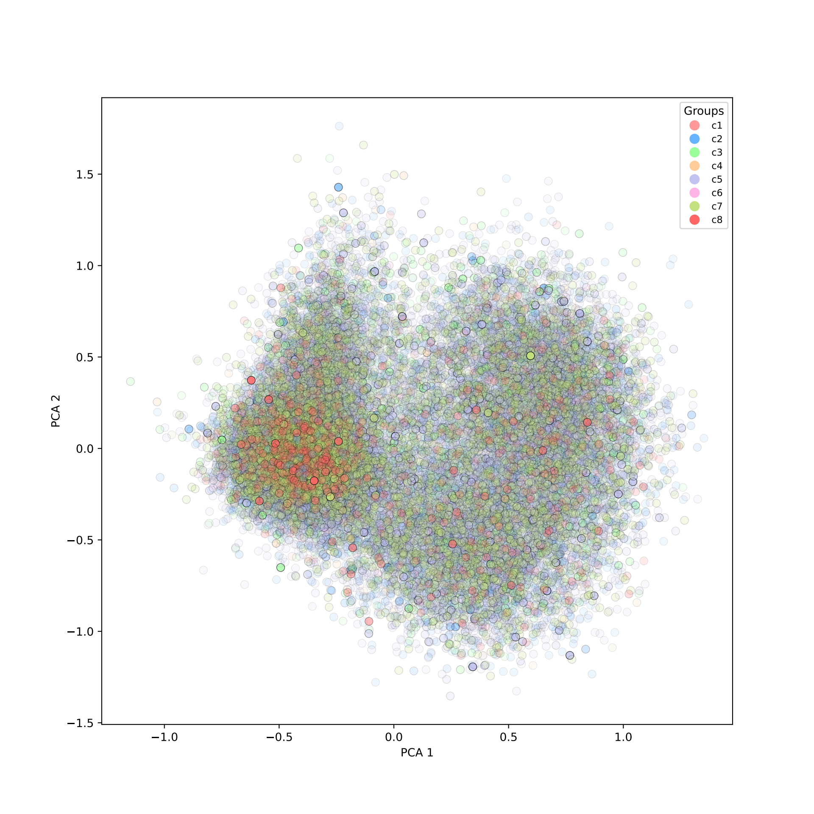
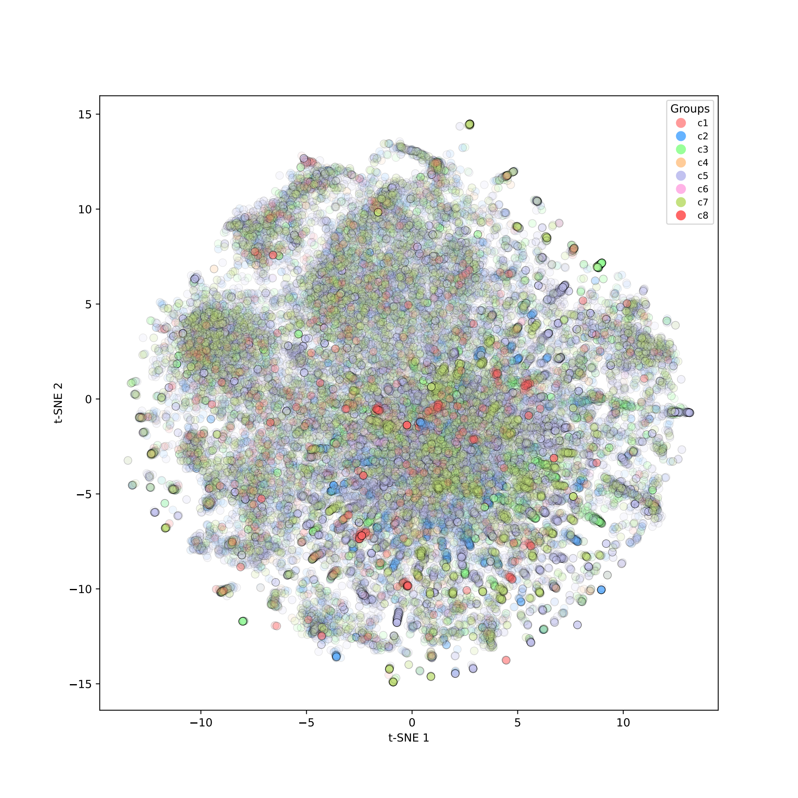
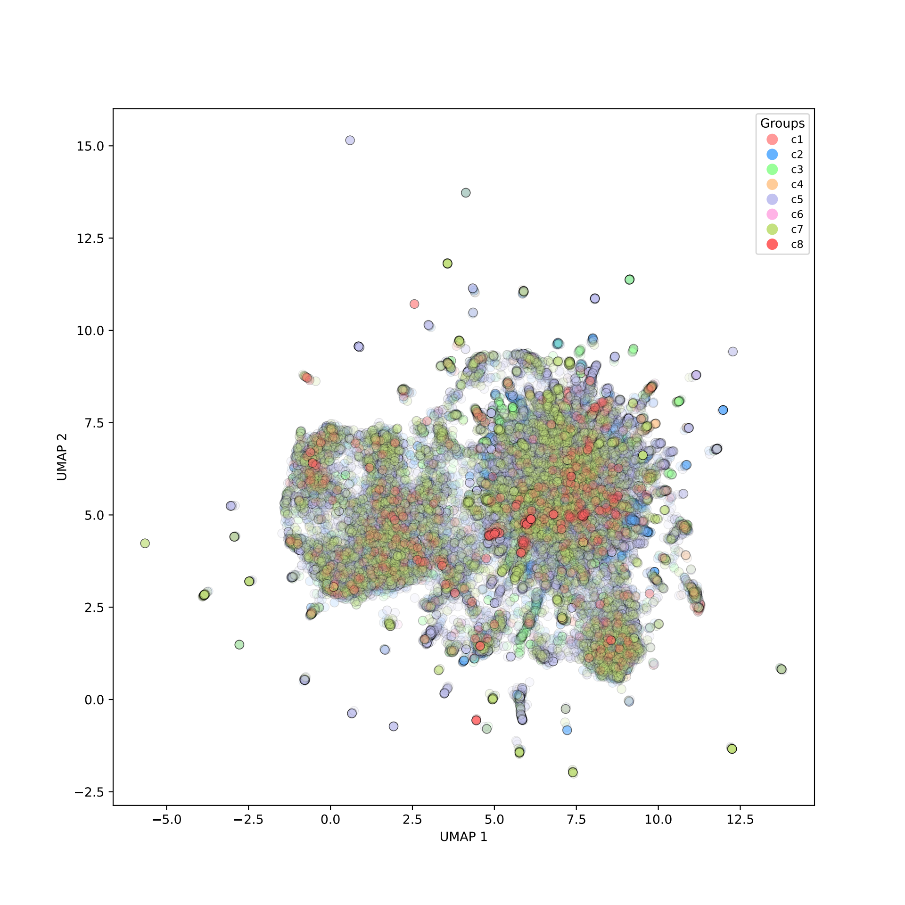

# MsigDB_mining
Extend beyond conventional bipartite models by integrating attribute-driven knowledge from the Molecular Signatures Database (MSigDB) using the node2vec algorithm. 

# Biological Network Analysis Using Node2Vec

This repository contains code for exploring biological networks and discovering relationships between genes and biological terms using the Node2Vec algorithm. The project includes functionality for data preprocessing, hyperparameter search, training, and cross-species validation. 

## Term Embeddings Dimensionality Reduction (64-dim to 2-dim)

Below are visualizations of the term embeddings and the minimum spanning tree:

<p align="center">
  
  t</i>-SNE" width="30%">
  
</p>

## MST

We implemented a 5% distance threshold, retaining only the shortest distances among the nodes. The visualization of the MST was facilitated using Python’s Plotly library, employing a spring layout to effectively position the nodes within a two-dimensional space. The nodes are color-coded according to their respective groups, enabling rapid identification and analysis of related terms.


## Data Preprocessing

The data must contain a two-column dataframe where the left column represents biological terms and the right column represents gene names in a many-to-many relationship.

```python
from utils import process_data

file_path = 'path/to/your/data.csv'  # Path to the input data
files = process_data(file_path)
data, term_to_index, gene_to_index = files
```

## Hyperparameter Search

After preprocessing the data, the next step is to run hyperparameter optimization for the Node2Vec model.

```python
from sklearn.pipeline import Pipeline
from model import MyNode2Vec
from utils import run_hyperparameter_search
from config import param_list

# Build the pipeline and run the hyperparameter search
pipeline = Pipeline([
    ("n2v", MyNode2Vec(data.edge_index, calculate_distances=False))
])

best_params, best_score = run_hyperparameter_search(pipeline, data, param_list)
print("Best Params:", best_params)
print("Best Score:", best_score)
```

## Model Training

Once you have the best hyperparameters, use them to train the Node2Vec model.

```python
from model import MyNode2Vec

node2vec = MyNode2Vec(
    data.edge_index,
    embedding_dim=64,
    walk_length=20,
    context_size=20,
    walks_per_node=20,
    num_negative_samples=10,
    p=0.5,
    q=0.25
)

# Fit the model
node2vec.fit(data)
```

## Generate Distance Matrix

After training the model, generate the distance matrix from the embeddings.

```python
from utils import distance_matrix

distance_matrix = distance_matrix(node2vec, files)
```

## Minimum Spanning Tree Generation

With the distance matrix, you can generate the minimum spanning tree (MST) to explore the relationships between terms.

```python
from model import generate_mst_from_files

mst = generate_mst_from_files(files, distance_matrix)
```

## Cross-Species Embedding

For cross-species validation, preprocess the data as before, but map the genes to human homologs while keeping mouse terms.

```python
from model import MyNode2Vec

# Initialize the Node2Vec model with pre-trained parameters
node2vec = MyNode2Vec(
    edge_index=data.edge_index,
    embedding_dimension=64,
    walk_length=20,
    context_size=20,
    walks_per_node=30,
    p=0.5,
    q=0.25,
    num_negative_samples=10
)

# Load the pre-trained model parameters
model.load_state_dict(state_dict)

# Generate embeddings using the trained model
embeddings = node2vec.transform(data)
```

# How to Run the Project
1. Clone the repository.
2. Install the required dependencies by running:
```bash
pip install -r requirements.txt
```
3. Download the dataset as instructed in the `Data Availability` section and place it in the `data/` directory.
4. Run the preprocessing, hyperparameter search and training scripts as described above.
